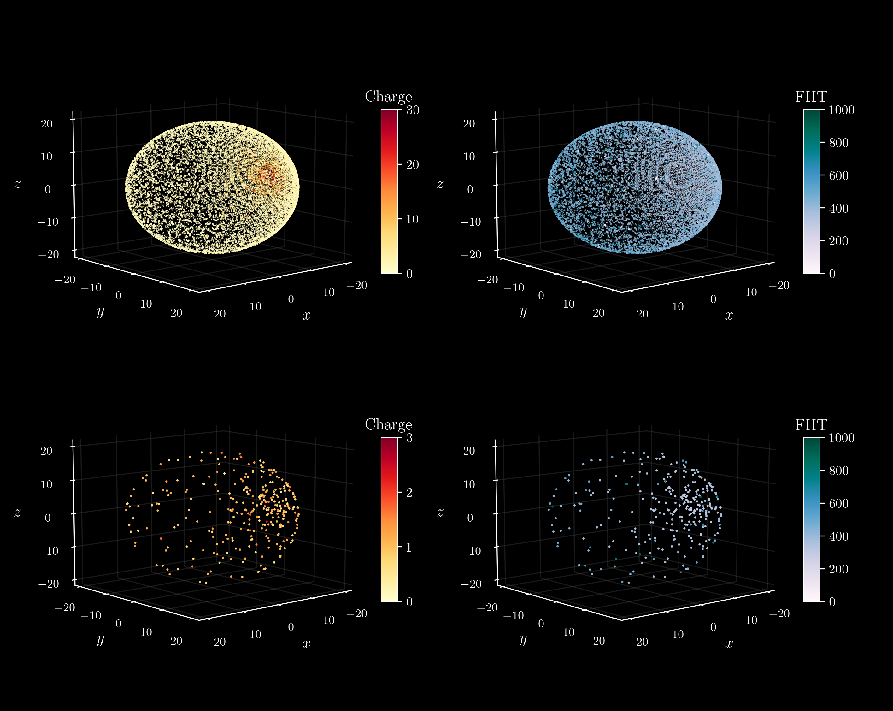
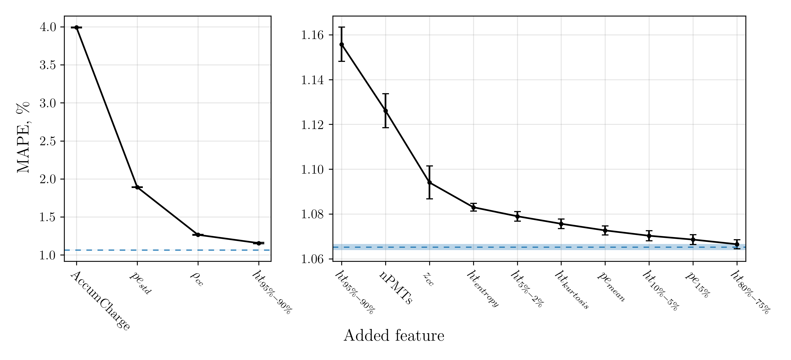
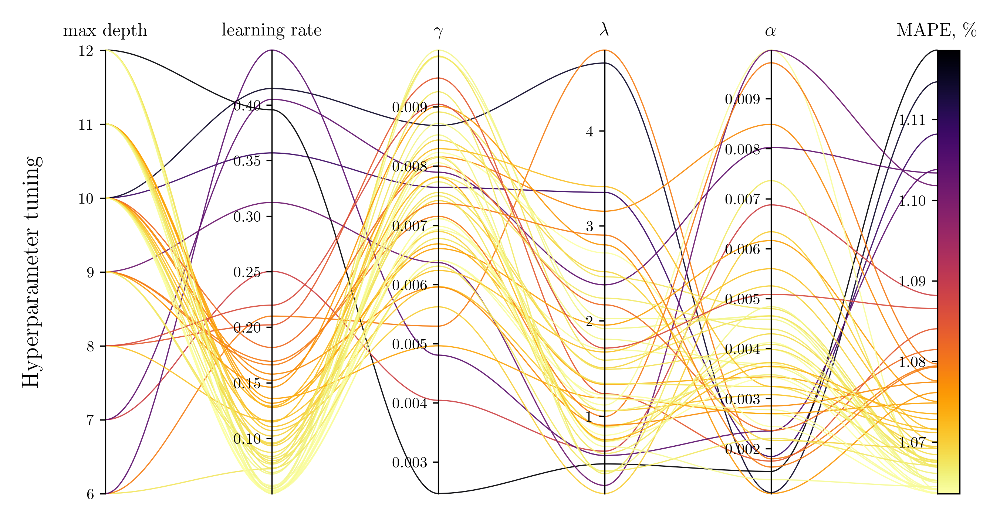
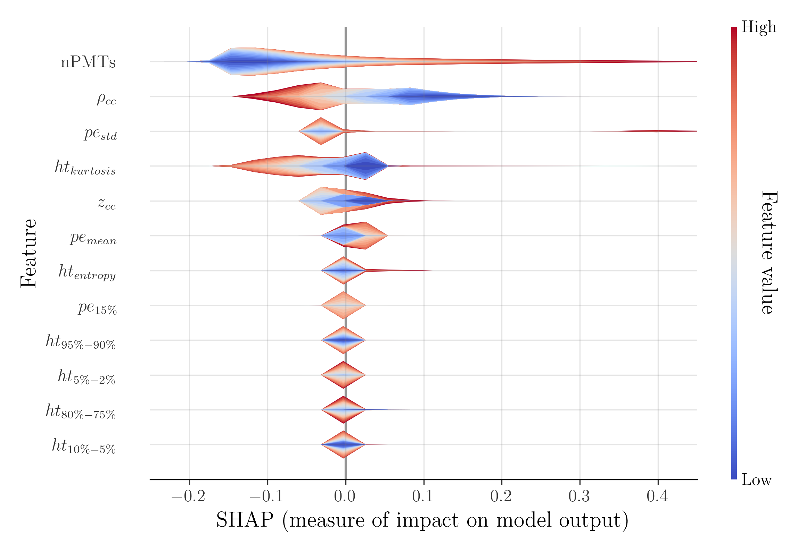
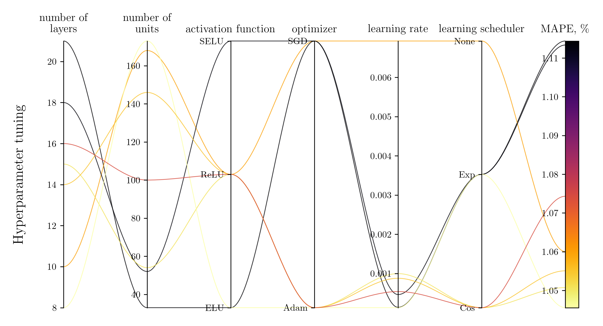
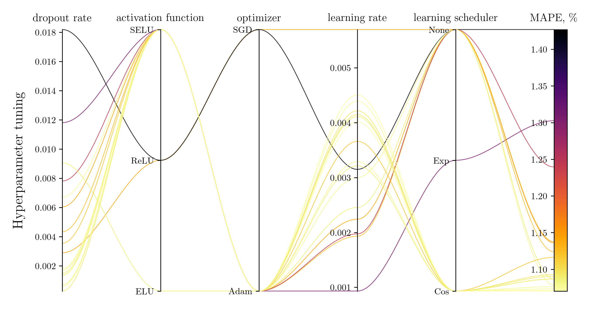

# Deep Learning Energy Reconstruction at the JUNO Experiment

  

JUNO is a neutrino observatory. It detects neutrinos via the so called Inverse Beta Decay (IBD) in a large scintillator volume. The scintillation light produced in the interaction is collected by photomultiplier tubes (PMTs), each with two channels: charge and first-hit-time. In the past complex CNN architectures have been used to reconstruct the energy using all the available information. The purpose of this repository (and of my BSc Thesis) is to engineer a small set of features with which to reconstruct the energy via simpler (and faster) Machine Learning algorithms: Boosted Decision Trees (BDT), a Fully Connected Deep Neural Network (FCDNN) and a 1-Dimensional Convolutional Neural Network (1DCNN). The code has been run on a machine hosted by CloudVeneto and equipped with a NVIDIA Tesla T4 GPU.

## Table of contents
1. [Feature Engineering](#feature_engineering)
2. [Feature Selection](#feature_selection)
3. [BDT](#bdt)
4. [FCDNN](#fcdnn)
5. [1DCNN](#1dcnn)
6. [Results](#results)

## Feature Engineering 

  

In `feature_pipeline.ipynb` raw data from PMTs is processed and fed to `helper_functions/feature_engineering.py`. 162 features are engineered: $\texttt{AccumCharge}$, $\texttt{nPMTs}$, features characterizing the positions of the center of charge and of the center of first-hit-time, in addition to features characterizing the distributions of charge and of first-hit-time. As many of these are highly correlated, further simplification is possible via feature selection. 

## Feature Selection 
The algorithm is based around BDTs and works as follows:
- BDT is trained with 162 features, MAPE (\%) is used as measure of performance with its error given by 5-fold cross-validation;
- The features capable of the best performance on its own is found (unsurprisingly it is $\texttt{AccumCharge}$, linearly correlated with the energy);
- At each iteration, the feature giving the best gain in perfomance is added, until MAPE (\%) becomes statistically compatible with the value found when training on all features. 

In total 13 features are selected.

  

## Boosted Decision Trees 
Now Bayesian optimization of the BDT hyperparameters is performed using Optuna. `helper_functions/parallel_coordinates_plot.py` contains a useful function to visualize the process.

  

In addition, SHAP (SHapley Additive exPlanations) values are computed to assess the contribution of each feature to the model's predictions. $\texttt{AccumCharge}$ is discared for visualization purposes as its contribution is much larger. 

  

## Fully Connected Deep Neural Network 
In this case Bayesian optimization is performed on hyperparameters related both to the model's architecture and to the training process. In addition Optuna's Median Pruner is used to discard unpromising trials, speeding up the process.

  

## 1-Dimesional Convolutional Neural Network 
CNNs should not perform well on tabular data as there are no local characteristics they can capture (the ordering of columns is arbitrary). However, by adding a fully connected layer immediately after input, the model is capable of learning on its own a useful spacial representation of the features on which the convolutional layers can then work on. \
To prevent overfitting and instability due to the complex architecture several regularization techniques have been implemented: dropout layers, batch normalization, weight normalization, a shortcut in the architecture skipping two concolutional layers, ... \
Bayesian optimization of the hyperparameters (with pruning) is performed. 

  

## Results 
The testing dataset is given by 14 subsets of simulated events at 14 different energies. For each subset a Gaussian fit of the difference between true and predicted values is performed. From the mean $\mu$ and the standard deviation $\sigma$ returned by the fit, bias and resolution can be computed. 

  

Bias is sistematically different from 0 at lower energies. This is due to the models learning to expect data in a fixed energy range. Too close to the boundaries the residuals deviate from Guassianity. Bias is compatible with 0 at higher energies for both BDT and FCDNN, while 1DCNN's predictions remain biased. This is possibly due to overfitting of the training dataset, caused by excessive instability in the validation loss. \
Resolution follows the expected trend for all models, with neural networks performing consistently better than tree-based models. Overall all models satisfy the resolution requirements for the JUNO experiment.
